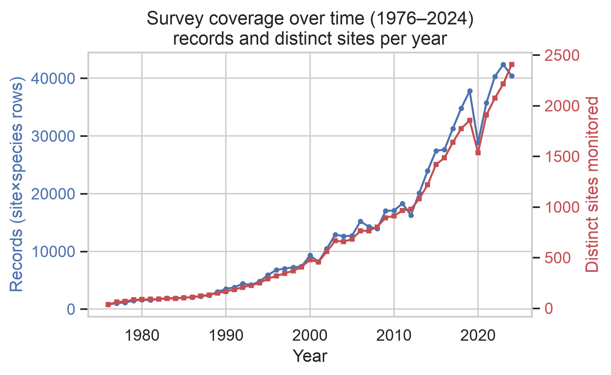
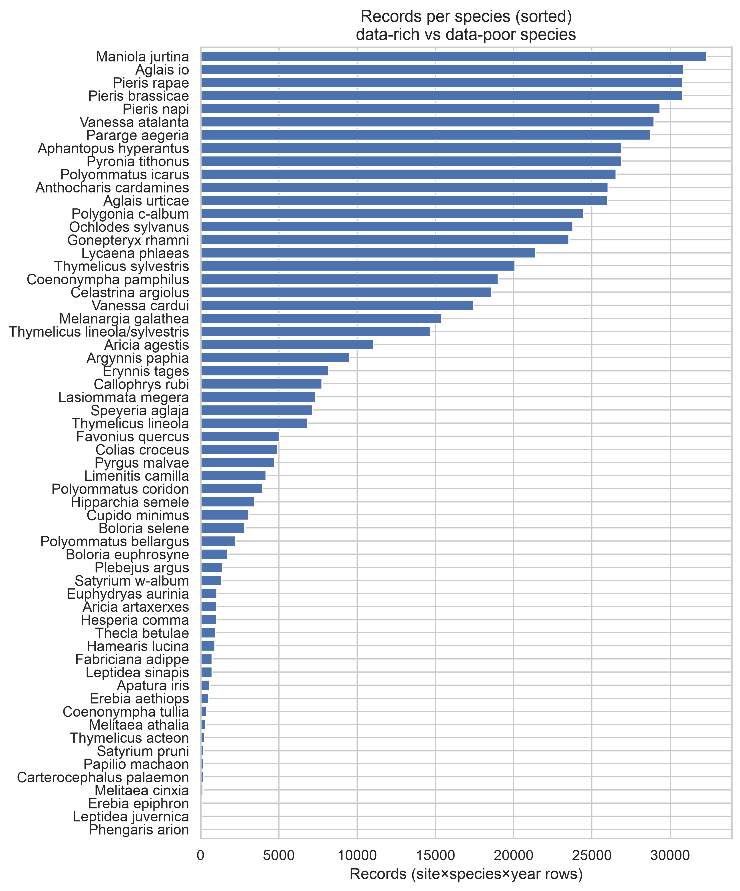
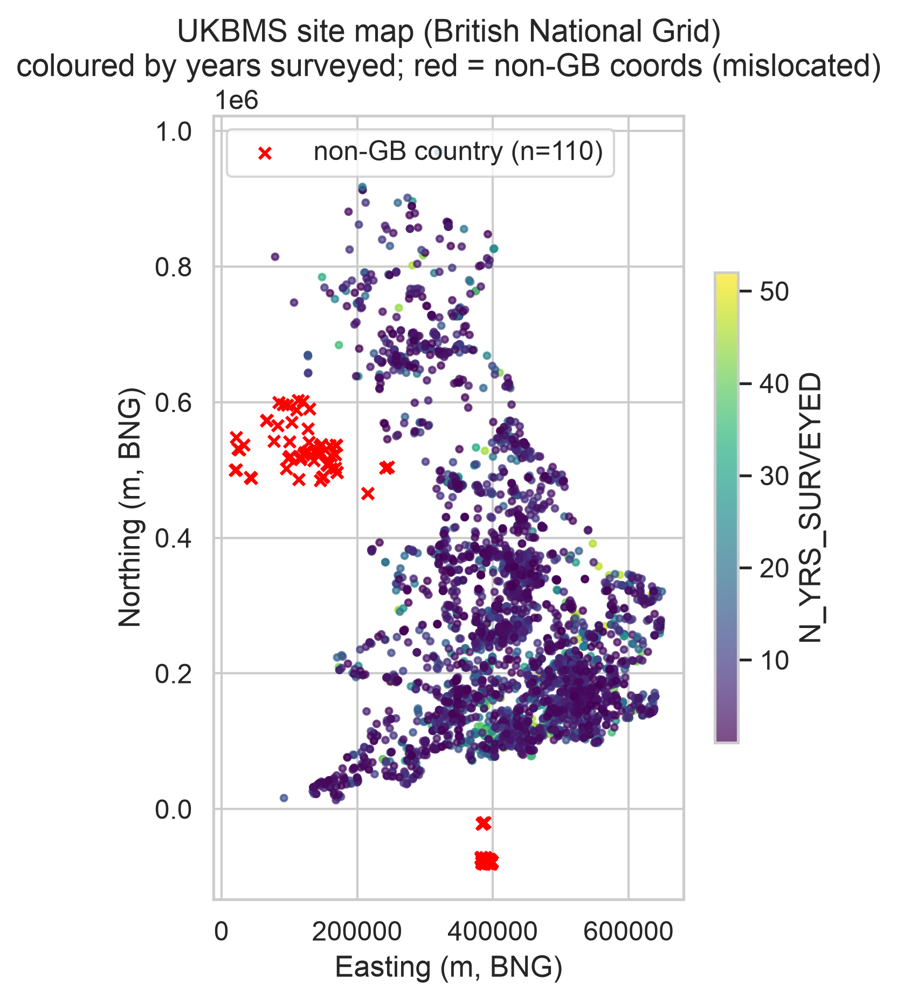
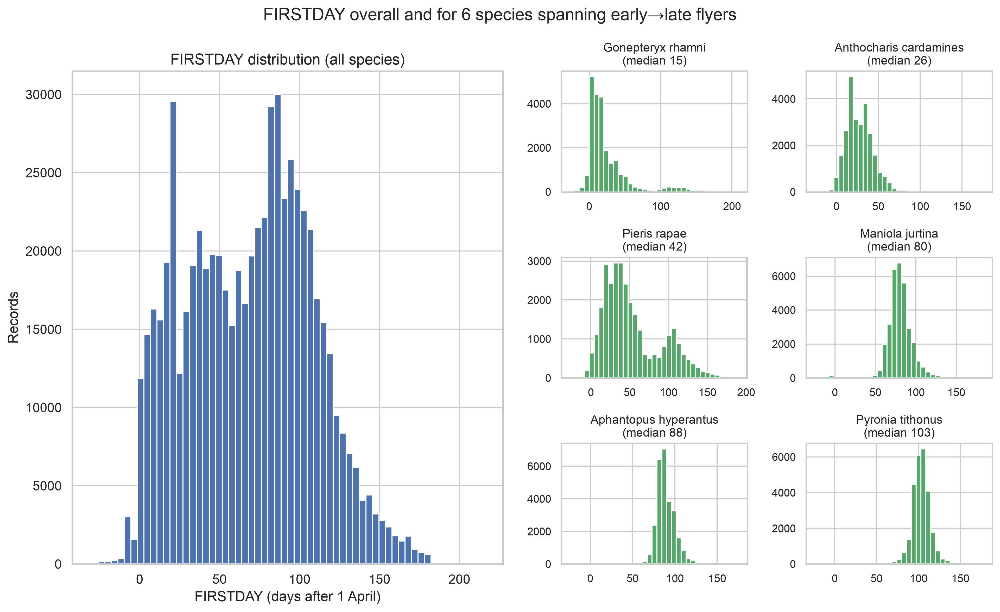
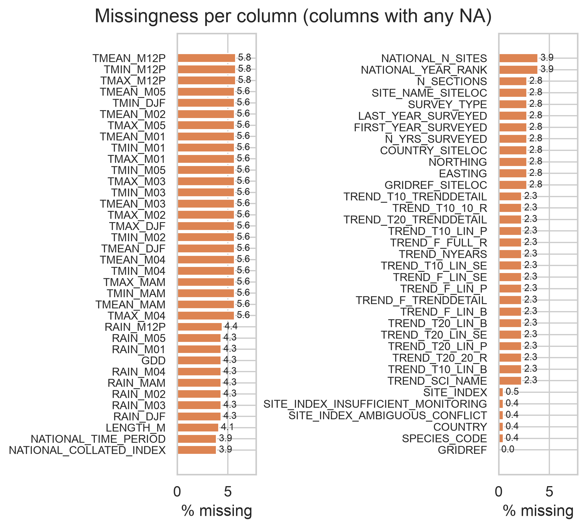
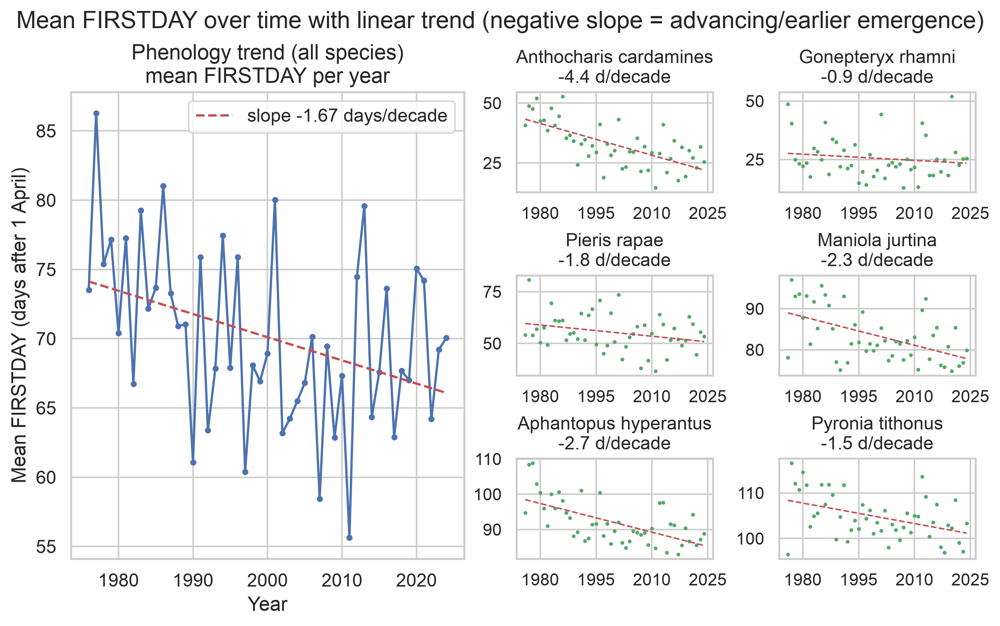
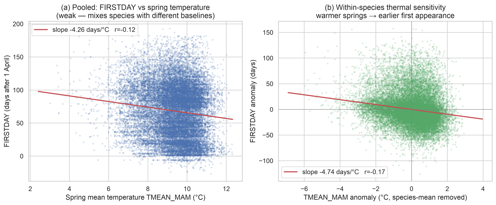
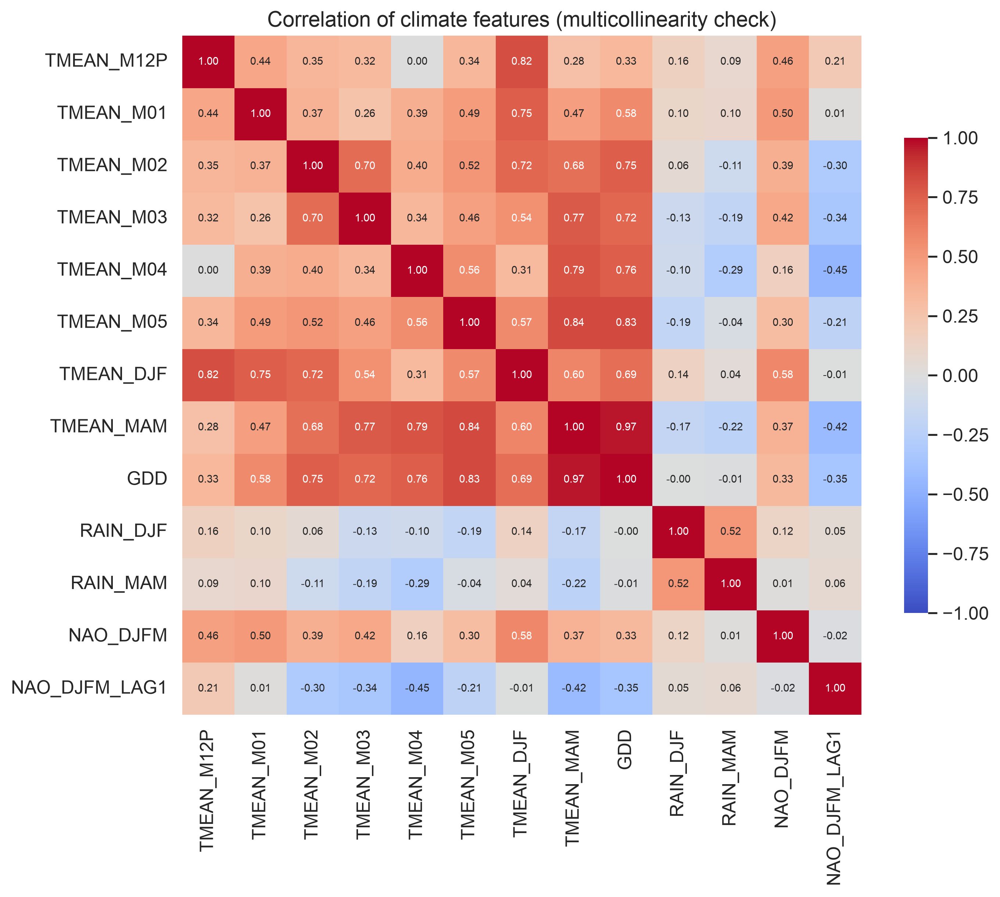
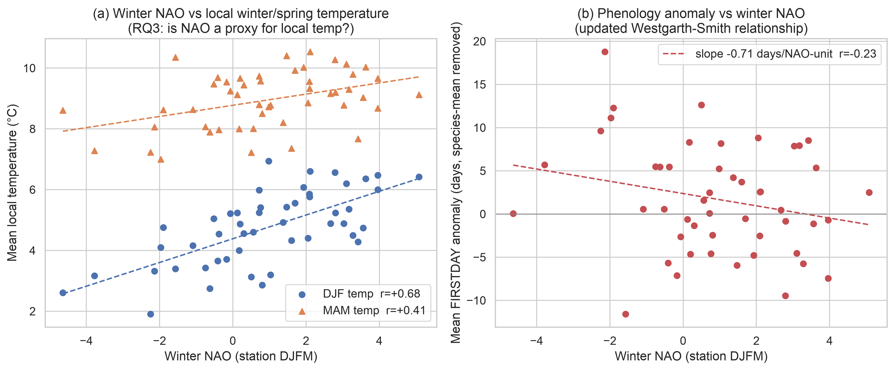

# Exploratory Data Analysis — UKBMS feature table

_Generated 2026-07-17. Source: `data/feature_table.parquet` (read-only). Figures in `output/eda/`. Target of interest = **FIRSTDAY** (first appearance, days after 1 April; negative = before 1 April)._

## Data-version note

The project uses the **UKBMS 1976–2024 phenology release**, which is **whole-season only** — it has **no per-generation / brood columns** (unlike the 1976–2022 release). Brood splits are therefore not used; voltinism is instead derived at the **species level** from the trait database (Cook et al. 2022, cross-checked against Middleton-Welling et al. 2020). **Why the 2024 release:** it is required to extend the record beyond Westgarth-Smith (2012) and to supply the recent warm years needed for the distribution-shift (temporal hold-out) test in the modelling phase, so first-generation emergence is captured via **FIRSTDAY (first appearance)** rather than an explicit first-brood column.

## Summary

| metric                     | value                                          |
| -------------------------- | ---------------------------------------------- |
| rows (site×species×year) | 648,788                                        |
| distinct sites             | 3,974                                          |
| distinct species           | 60                                             |
| year range                 | 1973–2024 (climate/coverage focus 1976–2024) |
| FIRSTDAY mean ± sd        | 68.5 ± 39.5 days after 1 Apr                  |
| FIRSTDAY median [min, max] | 72 [-30, 215]                                  |

**Per-column missingness (top, % NA):** `NAO_DJFM` 6.2%, `TMEAN_M12P` 5.8%, `TMIN_M12P` 5.8%, `TMAX_M12P` 5.8%, `TMEAN_M04` 5.6%, `TMEAN_M05` 5.6%, `TMEAN_M02` 5.6%, `TMEAN_M01` 5.6%, `TMIN_M01` 5.6%, `TMAX_M01` 5.6%, `TMAX_M05` 5.6%, `TMAX_M03` 5.6%, `TMIN_M03` 5.6%, `TMEAN_M03` 5.6%, `TMAX_M02` 5.6%. Full breakdown in fig 5.

## Figures

### Survey coverage over time

Records and distinct sites per year, 1976–2024. Effort grows markedly (≈36 sites in 1976 → 2,406 in 2024), reflecting WCBS expansion — later years dominate the sample, which matters for any pooled trend.

### Records per species

Strongly unbalanced: richest = Maniola jurtina (32,306 rows), poorest = Phengaris arion (48); 10 species have <500 records. Per-species models for data-poor species will be unstable.

### Site map (British National Grid)

Distinct sites coloured by years surveyed; the GB points form the recognisable shape of Great Britain with no GB points in the sea. **110 non-GB sites (red ×)** are mislocated exactly as expected — Northern Ireland (Irish Grid, projected into the Irish Sea) and Channel Islands (negative northing, min -81059 m); these were excluded from the climate join. 368 sites have no coordinates.

### FIRSTDAY distribution

Overall FIRSTDAY plus 6 species spanning early→late flyers. Overall is right-skewed; per-species distributions are much tighter and well separated, confirming species identity is the dominant driver of absolute emergence date.

### Missingness per column

Percent NA per column. Climate/NAO features are missing for the non-BNG / no-coordinate sites and (for NAO_DJFM) flight-year 2024; the target FIRSTDAY is complete. No column is imputed.

### Phenology trend over time

Mean FIRSTDAY per year is **advancing 1.68 days/decade** overall (r=-0.377). Per-species slopes vary sensibly — early-spring *Anthocharis cardamines* advances fastest, adult-overwintering *Gonepteryx rhamni* barely moves. **Yes, emergence is advancing.**

### FIRSTDAY vs spring temperature

(a) Pooled FIRSTDAY vs TMEAN_MAM is negative but weak (slope -4.261 days/°C, r=-0.119) because pooling mixes species baselines; (b) after removing species means the within-species response is the correct, stronger view (slope -4.737 days/°C, r=-0.168): warmer springs → earlier flight. Record-level noise is large; the year-level signal (fig 6) is clearer.

### Climate feature correlations

 
Temperature features are highly collinear (strongest pair TMEAN_MAM–GDD, r=0.965); GDD and seasonal means are near-duplicates of the monthly temps. **Multicollinearity** must be handled in modelling (regularisation / feature selection / a process feature rather than all raw temps).

### Winter NAO relationships

(a) Winter DJFM NAO tracks local temperature (DJF r=0.676, MAM r=0.406) — **NAO is largely a winter-temperature proxy** (informs RQ3, i.e. NAO adds little beyond local temp for prediction). (b) Mean FIRSTDAY anomaly vs winter NAO is negative (slope -0.72 days/NAO-unit, r=-0.236, 48 years): positive NAO → earlier emergence — the updated Westgarth-Smith relationship, modest at year level.

## Data issues found

- 110 sites have non-GB coordinates (Northern Ireland Irish-Grid / Channel Islands / Isle of Man); min northing -81059 m (Channel Islands are negative). These plot mislocated on a BNG map and were excluded from the climate join upstream.
- 368 distinct sites have no coordinates (cannot be mapped or climate-joined).
- FIRSTDAY ranges -30…215 days after 1 April; negative values = species first seen before 1 April (early spring flyers), plausible not erroneous.
- NAO_DJFM missing for flight-year 2024 (station index ends 2023); NAO figures use 1976–2023 fully, 2024 only via LAG1.
- Data-poor species: 10 of 60 species have <500 records (poorest: Phengaris arion, 48); per-species models for these will be unstable.

## Part B — Species voltinism lookup

Deliverable: `data/species_voltinism.csv` (SPECIES_NAME, voltinism, source, note), classifying each of the 60 species as univoltine / multivoltine, with latitude/region-variable species flagged `variable` and anything unmatched or ambiguous flagged `MANUAL_REVIEW`. **No voltinism value is guessed.**

**Sources & access (accessed 2026-07-17):**

- *Primary* — Cook, P.M.; Tordoff, G.M.; Davis, A.M.; Parsons, M.S.; Dennis, E.B.; Fox, R.; Botham, M.S.; Bourn, N.A.D. (2021). Traits data for the butterflies and macro-moths of Great Britain and Ireland, 2021. NERC EDS Environmental Information Data Centre. https://doi.org/10.5285/5b5a13b6-2304-47e3-9c9d-35237d1232c6 (Open Government Licence).
- *Cross-check* — Middleton-Welling, J.; Dapporto, L.; García-Barros, E.; Wiemers, M.; Nowicki, P.; Plazio, E.; Bonelli, S.; Zaccagno, M.; Šašić, M.; Liparova, J.; Schweiger, O.; Harpke, A.; Musche, M.; Settele, J.; Schmucki, R.; Shreeve, T. (2020). A new comprehensive trait database of European and Maghreb butterflies. Dryad. https://doi.org/10.5061/dryad.6m905qfx6 (CC0).

**Classification method (from Cook's own categories, no guessing):** `obligate_multivoltine` → **multivoltine**; `partial_generation` → **variable** (facultative / partial second brood — the region- & latitude-dependent case the brief asks to flag); `obligate_univoltine` → **univoltine**; none set → `MANUAL_REVIEW`. Names joined on `scientific_name` (normalising the non-breaking spaces in the source) with a genus-synonym table for *Colias crocea*, *Lysandra bellargus/coridon*.

Assigned from source: **59/60** (the primary source Cook et al. covers every species). Class counts: univoltine 32, multivoltine 14, variable 11, MANUAL_REVIEW 1.

> **Cross-check status:** the Middleton-Welling (Dryad, CC0) dataset could not be retrieved automatically (JavaScript anti-bot wall), so classifications rest on the primary source (Cook et al.) alone. Drop the Middleton-Welling xlsx into `./data/` and re-run to auto-add the cross-check; any source disagreement will be flagged `MANUAL_REVIEW`.

**Manual-review species (1)** — unmatched, ambiguous, or sources disagree:

- `Thymelicus lineola/sylvestris`

Known review cases regardless of source: **`Thymelicus lineola/sylvestris`** is a recorder aggregate of two species and cannot take a single class; the cryptic *Leptidea* pair (`juvernica`/`sinapis`) needs care. Several UKBMS names differ from trait-DB genera (e.g. *Aglais io* ↔ *Inachis io*, *Speyeria/Fabriciana* ↔ *Argynnis*, *Favonius quercus* ↔ *Neozephyrus quercus*, *Phengaris arion* ↔ *Maculinea arion*) — handled by a synonym table.

## Artefacts

- `output/eda/*.png` — figures 1–9
- `output/eda_report.md` — this report
- `data/species_voltinism.csv` — voltinism lookup (59/60 classified from Cook et al.; 1 aggregate on manual review)
