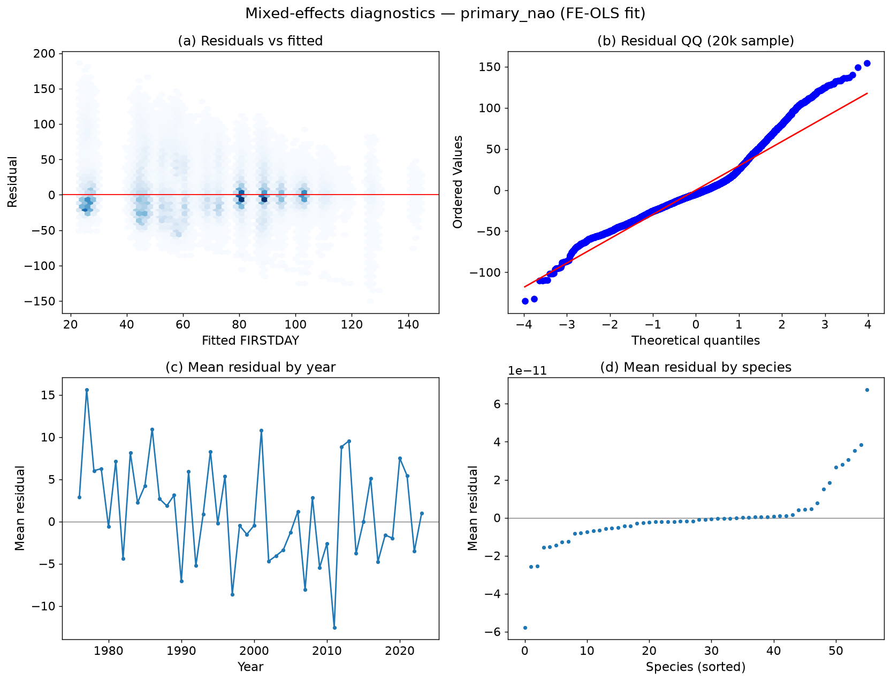

# Mixed-effects report — RQ1 (NAO × voltinism → FIRSTDAY)

_Generated 2026-09-05. Target = FIRSTDAY (days after 1 April). Code: `scripts/modelling/{fix_nao_2024,mixed_effects,me_report}.py`._

**RQ1:** does the NAO–phenology relationship hold over 1976–2024, and does it still differ by voltinism, once site-level variation is accounted for? (Updates Westgarth-Smith et al. (2012).)

## Part 1 — 2024 winter-NAO gap fix

- The Hurrell station DJFM index ends 2023, so flight-year 2024 (in the temporal TEST set) had `NAO_DJFM = NaN`.
- Built a CPC DJFM series ourselves from the NOAA CPC monthly NAO, then regressed Hurrell on CPC over the 73 overlapping years (1951–2023): **Hurrell = +0.001 + 2.798·CPC**, r = 0.909 (R² = 0.826), RMSE = 0.90.
- CPC DJFM 2024 = +0.754 → **rescaled onto the Hurrell scale = +2.112** and written into `NAO_DJFM` for the 40,420 flight-year-2024 rows.
- Added column **`NAO_SOURCE`** so the substitution is auditable: {'hurrell': 608368, 'cpc_rescaled': 40420}. The two products are **not** silently concatenated; the CPC value is explicitly rescaled and flagged `cpc_rescaled`.
- feature_table row count re-asserted unchanged (= 648,788).

## Part 2 — Modelling frame

- Reuses `output/modelling_frame.parquet` (same rows/splits as the baselines & GDD), joins `data/species_voltinism.csv` on SPECIES_NAME, and joins `TMEAN_MAM` from feature_table (row counts asserted after each merge).
- **Excluded 3 species with no usable voltinism class** (58,096 rows), for two distinct reasons: (a) the recorder **aggregate** ['Thymelicus lineola/sylvestris'] (cannot take a single class), and (b) the **migrants** ['Vanessa atalanta', 'Vanessa cardui'], which Cook leaves voltinism-blank as they have no fixed resident-UK generation structure. Both are stated, not silently dropped.
- Also dropped 7,512 rows missing a model predictor (TMEAN_MAM on a few site-years). **The target FIRSTDAY is never imputed.**
- **Analysis rows: 555,103** across 56 species and 3,496 sites. Voltinism (species counts): {'univoltine': 31, 'multivoltine': 14, 'variable': 11}.
- Predictors mean-centred: NAO (mean +0.95), TMEAN_MAM (mean 9.34 °C), YEAR (mean 2012). Centring leaves slopes unchanged, reduces main-vs-interaction collinearity.

### Specification & a note on voltinism identifiability

Primary: **FIRSTDAY ~ NAO_DJFM × VOLTINISM + YEAR_c + species FE + (1 | SITE_ID)**. Because **voltinism is nested in species**, its *main* effect is collinear with the species fixed effects and is deliberately omitted (absorbed by the species dummies); the **NAO × voltinism interaction** is still identified from within-species year-to-year NAO variation. We build explicit interaction columns (`NAO_c_multi`, `NAO_c_var`) so the design is full-rank (no silent rank deficiency).

**Why YEAR_c is included:** NAO varies *only by year* and is confounded with the long-term warming trend, so without a year term an NAO coefficient could merely capture warming. Reported with and without YEAR_c below.

### Estimation routes (all reported — no silent switching)

1. **MixedLM** (statsmodels, site random intercept): converged in 8.5 s (status `ok`) on the full 555,103 rows — used for the **variance decomposition / ICC**.
2. **FE-OLS + cluster-robust SEs** (species dummies; two-way clusters SITE_ID × YEAR): the **coefficient workhorse** — cov used = `cluster_twoway_site_year`.
3. **Two-stage**: per-species OLS of FIRSTDAY on NAO_c + YEAR_c, then precision-weighted meta-analysis of the NAO slopes by voltinism — a transparent Westgarth-Smith et al. (2012)-style cross-check.

> **Key inference point.** NAO takes one value per year — only ~49 independent observations across 1976–2024. **Year clustering is what makes the SEs honest**: model-based MixedLM/OLS SEs (treating the ~555k rows as independent given site) would badly overstate NAO significance. So we read significance off the **year-clustered** SEs and use MixedLM only for the variance components.

### Site random effect (MixedLM variance components)

- Site-intercept SD = **10.6 days**, residual SD = **29.0 days** → **ICC = 0.118** (≈ 12% of the leftover variance, after species FE + NAO + year, is between-site). Site variation is real and worth a random intercept, but species identity dominates.

### NAO effect by voltinism (days per NAO unit)

Primary (FE-OLS, **with YEAR_c**, year-clustered CIs):

| class | days/NAO-unit | se | ci_low | ci_high |
| --- | --- | --- | --- | --- |
| univoltine | -0.407 | 0.361 | -1.116 | 0.301 |
| multivoltine | -0.358 | 0.671 | -1.674 | 0.957 |
| variable | -0.386 | 0.563 | -1.489 | 0.717 |

Without YEAR_c:

| class | days/NAO-unit | se | ci_low | ci_high |
| --- | --- | --- | --- | --- |
| univoltine | -0.406 | 0.360 | -1.112 | 0.300 |
| multivoltine | -0.357 | 0.675 | -1.680 | 0.966 |
| variable | -0.385 | 0.567 | -1.497 | 0.727 |

Two-stage meta-analysis (per-species slopes pooled by class; **narrower CIs — see caveat**):

| class | n_species | nao_slope_wmean | se | ci_low | ci_high | slope_sd_across_species |
| --- | --- | --- | --- | --- | --- | --- |
| multivoltine | 14 | -0.426 | 0.037 | -0.498 | -0.354 | 0.677 |
| univoltine | 31 | -0.384 | 0.016 | -0.416 | -0.353 | 0.494 |
| variable | 11 | -0.512 | 0.034 | -0.578 | -0.445 | 0.377 |

_Caveat:_ the two-stage CIs treat each species' slope as independent, but all species share the same NAO years, so they **understate** uncertainty; the year-clustered FE-OLS CIs are the honest ones. The point estimates agree across all three routes (MixedLM NAO_c = -0.45).

**Interaction (difference in NAO slope vs univoltine):** multivoltine − univoltine = +0.05 days/unit (CI -0.91, +1.01); variable − univoltine = +0.02 (CI -0.77, +0.82). Both interaction CIs straddle 0 → **no detectable voltinism difference** in the NAO response over the full record.

### Sensitivity — binary voltinism (univoltine vs multivoltine, 'variable' excluded; n = 478,045). Closest to the Westgarth-Smith et al. (2012) dichotomy:

| class | days/NAO-unit | se | ci_low | ci_high |
| --- | --- | --- | --- | --- |
| univoltine | -0.406 | 0.361 | -1.114 | 0.302 |
| multivoltine | -0.357 | 0.672 | -1.674 | 0.960 |

Interaction NAO×multivoltine = +0.049 days/unit (CI -0.91, +1.01) — again indistinguishable from 0.

### Local temperature vs NAO (RQ3 set-up)

Spring-temperature (TMEAN_MAM) effect by voltinism (days per °C):

| class | days/degC | se | ci_low | ci_high |
| --- | --- | --- | --- | --- |
| univoltine | -4.025 | 0.343 | -4.697 | -3.352 |
| multivoltine | -5.386 | 0.628 | -6.616 | -4.156 |
| variable | -4.750 | 0.560 | -5.848 | -3.653 |

**Temperature × voltinism IS detectable:** multivoltine species are more spring-temperature-sensitive than univoltine — interaction TMAM×multivoltine = -1.36 days/°C (CI -2.51, -0.21, p = 0.020). So voltinism modulates the **temperature** response though not the (weak) NAO response — a better-identified contrast, since local temperature varies site×year, not just year.

**Both together (NAO + spring temp), NAO slopes once local temp is in the model:**

| class | days/NAO-unit | se | ci_low | ci_high |
| --- | --- | --- | --- | --- |
| univoltine | 0.464 | 0.208 | 0.057 | 0.871 |
| multivoltine | 0.827 | 0.567 | -0.284 | 1.937 |
| variable | 0.617 | 0.482 | -0.328 | 1.561 |

VIFs (both-model continuous terms):

| term | VIF |
| --- | --- |
| NAO_c | 3.01 |
| NAO_c_multi | 2.57 |
| NAO_c_var | 1.58 |
| TMAM_c | 3.12 |
| TMAM_c_multi | 2.61 |
| TMAM_c_var | 1.58 |
| YEAR_c | 1.07 |

**NAO sign flip — the RQ3 headline.** The univoltine NAO slope is -0.41 days/unit marginally, but with spring temperature added it **flips to +0.46** (CI +0.06, +0.87). A reversal under moderate collinearity (VIF ≈ 3; EDA NAO–DJF-temp r ≈ 0.68) means the two share their predictive content: **NAO's apparent phenology effect operates through local temperature, not independently of it.** We do not over-claim from an unstable coefficient — NAO carries little beyond local temperature, which sets up RQ3. Spring temperature itself stays large and stable (≈ −4.4 days/°C) in both models.

### Full coefficient tables (non-species terms; 95% CIs)

**primary_nao** — R² = 0.416, n = 555,103, cov = `cluster_twoway_site_year`:

| term | estimate | se | ci_low | ci_high | p |
| --- | --- | --- | --- | --- | --- |
| const | 26.416 | 1.917 | 22.659 | 30.173 | 0.000 |
| NAO_c | -0.407 | 0.361 | -1.116 | 0.301 | 0.259 |
| NAO_c_multi | 0.049 | 0.490 | -0.910 | 1.009 | 0.920 |
| NAO_c_var | 0.021 | 0.405 | -0.773 | 0.816 | 0.958 |
| YEAR_c | 0.003 | 0.060 | -0.115 | 0.121 | 0.960 |

**primary_nao_noyear** — R² = 0.416, n = 555,103, cov = `cluster_twoway_site_year`:

| term | estimate | se | ci_low | ci_high | p |
| --- | --- | --- | --- | --- | --- |
| const | 26.417 | 1.924 | 22.645 | 30.189 | 0.000 |
| NAO_c | -0.406 | 0.360 | -1.112 | 0.300 | 0.260 |
| NAO_c_multi | 0.049 | 0.489 | -0.910 | 1.008 | 0.920 |
| NAO_c_var | 0.021 | 0.405 | -0.772 | 0.814 | 0.958 |

**climate_only** — R² = 0.432, n = 555,103, cov = `cluster_twoway_site_year`:

| term | estimate | se | ci_low | ci_high | p |
| --- | --- | --- | --- | --- | --- |
| const | 26.222 | 1.967 | 22.366 | 30.078 | 0.000 |
| TMAM_c | -4.025 | 0.343 | -4.697 | -3.352 | 0.000 |
| TMAM_c_multi | -1.361 | 0.587 | -2.512 | -0.210 | 0.020 |
| TMAM_c_var | -0.726 | 0.411 | -1.531 | 0.079 | 0.077 |
| YEAR_c | 0.123 | 0.056 | 0.013 | 0.233 | 0.028 |

**both** — R² = 0.433, n = 555,103, cov = `cluster_twoway_site_year`:

| term | estimate | se | ci_low | ci_high | p |
| --- | --- | --- | --- | --- | --- |
| const | 26.199 | 1.941 | 22.395 | 30.004 | 0.000 |
| NAO_c | 0.464 | 0.208 | 0.057 | 0.871 | 0.025 |
| NAO_c_multi | 0.363 | 0.518 | -0.653 | 1.378 | 0.484 |
| NAO_c_var | 0.153 | 0.429 | -0.688 | 0.993 | 0.722 |
| TMAM_c | -4.355 | 0.365 | -5.071 | -3.639 | 0.000 |
| TMAM_c_multi | -1.575 | 0.601 | -2.753 | -0.397 | 0.009 |
| TMAM_c_var | -0.819 | 0.395 | -1.593 | -0.045 | 0.038 |
| YEAR_c | 0.125 | 0.056 | 0.015 | 0.234 | 0.026 |

### Sensitivity — excluding flight-year 2024

Re-running the primary spec with 2024 dropped (524,672 rows) gives univoltine NAO slope -0.412 (vs -0.407 with the CPC-rescaled 2024). **Conclusions are unchanged** — the 2024 handling does not move the NAO or interaction estimates materially.

### Comparison to Westgarth-Smith et al. (2012)

- **Direction agrees:** the NAO–phenology slope is **negative** (positive winter NAO → earlier first appearance; ≈ -0.41 days per NAO unit for univoltine species), consistent with WS and with the EDA year-level relationship.
- **Strength / significance — we qualify WS:** over the *full* 1976–2024 record, with honest year-clustered SEs and species + site structure removed, the NAO effect is **weak and not statistically distinguishable from zero**. NAO's ~49 annual values simply do not pin the slope down tightly.
- **Voltinism difference — not supported:** unlike a simple univoltine/multivoltine split, we find **no detectable difference** in the NAO response between voltinism classes (all interaction CIs cover 0), in the 3-level primary and in the binary WS-style contrast.

### Model diagnostics

- Residual mean ≈ -0.00, SD ≈ 30.2 days. Residuals-vs-fitted show mild heteroscedasticity; the QQ plot has heavy tails (FIRSTDAY is bounded and right-skewed) — SEs are cluster-robust, so inference is not reliant on normality. Mean residual by year is centred on 0 (worst year 1977: +16.3 d); by species it is near 0 (species FE absorb baselines).

### Out-of-sample skill (shared harness, both regimes)

| model | regime | n | MAE | RMSE | R2 | bias |
| --- | --- | --- | --- | --- | --- | --- |
| ml_rf | grouped_cv | 620,711 | 20.30 | 28.69 | 0.47 | 0.07 |
| ml_rf_nonao | grouped_cv | 620,711 | 20.34 | 28.72 | 0.47 | 0.08 |
| ml_hgb | grouped_cv | 620,711 | 20.67 | 28.88 | 0.47 | 0.41 |
| ml_hgb_nonao | grouped_cv | 620,711 | 20.73 | 28.93 | 0.46 | 0.41 |
| me_nao_temp | grouped_cv | 524,672 | 21.31 | 29.66 | 0.44 | 0.00 |
| me_nao | grouped_cv | 524,672 | 21.83 | 30.16 | 0.42 | 0.00 |
| species_mean_mesubset | grouped_cv | 555,103 | 21.88 | 30.23 | 0.41 | 0.00 |
| site_species_mean | grouped_cv | 620,711 | 22.33 | 30.67 | 0.40 | 0.00 |
| species_mean | grouped_cv | 620,711 | 22.33 | 30.67 | 0.40 | 0.00 |
| gdd_process | grouped_cv | 612,192 | 22.41 | 32.36 | 0.33 | -5.12 |
| persistence | grouped_cv | 620,711 | 23.54 | 34.89 | 0.22 | -1.54 |
| ml_hgb | temporal | 325,738 | 21.22 | 29.82 | 0.40 | -1.01 |
| ml_hgb_nonao | temporal | 325,738 | 21.24 | 29.78 | 0.40 | -0.75 |
| site_species_mean | temporal | 325,738 | 21.27 | 30.46 | 0.37 | -0.26 |
| me_nao | temporal | 255,491 | 21.32 | 30.18 | 0.39 | -3.11 |
| ml_rf_nonao | temporal | 325,738 | 21.37 | 29.91 | 0.40 | -0.76 |
| ml_rf | temporal | 325,738 | 21.39 | 29.90 | 0.40 | -0.72 |
| me_nao_temp | temporal | 255,491 | 21.52 | 29.82 | 0.40 | -0.39 |
| species_mean_mesubset | temporal | 285,922 | 21.80 | 30.17 | 0.40 | -0.70 |
| species_mean | temporal | 325,738 | 21.97 | 30.29 | 0.38 | -0.23 |
| gdd_process | temporal | 321,773 | 23.15 | 34.42 | 0.20 | -10.48 |
| persistence | temporal | 325,738 | 23.23 | 34.42 | 0.20 | -2.05 |

`me_nao` = primary (NAO×voltinism + year + species FE); `me_nao_temp` adds spring temperature; `species_mean_mesubset` is the species-mean climatology scored on the **identical ME subset** (the fair anchor).

> **Read the `n` column carefully.** The ME models drop the two migrant *Vanessa* species (heavily recorded, with erratic arrival timing that inflates everyone's error), so the shared full-frame `species_mean` is *not* a like-for-like comparator. Against the same-subset anchor: in **grouped-CV** `me_nao_temp` improves MAE to ~21.3 vs ~21.9 (a real ~0.6-day gain from spring temperature); in the **temporal** hold-out the models are ~tied, and `me_nao` (no temperature) is barely above the anchor. **Temperature structure buys a modest gain; NAO structure essentially none** — consistent with the sign flip. This rung's value is chiefly scientific (RQ1 inference), not point-prediction.

## Assumptions & judgement calls

- **2024 NAO:** filled from CPC DJFM rescaled onto the Hurrell scale via the overlap regression (not raw-concatenated); flagged in NAO_SOURCE. Excluding 2024 instead leaves conclusions unchanged (shown above).
- **Voltinism:** primary = 3-level (univoltine ref / multivoltine / variable); excluded the Thymelicus lineola/sylvestris aggregate and the two migrants (Vanessa atalanta, V. cardui) Cook leaves voltinism-blank; binary uni-vs-multi reported as the WS-style sensitivity.
- **Species as fixed effect** (dummies) absorbs the dominant per-species baseline the EDA showed; voltinism main effect is therefore not separately identified (nested).
- **Site as random intercept** (MixedLM) / **clustered by SITE_ID** (FE-OLS) — two ways to handle within-site correlation; both reported and they agree.
- **Inference on NAO uses year-clustered SEs** because NAO varies only annually; model-based SEs would overstate significance.
- **YEAR_c included** to separate the NAO signal from the secular warming trend; with/without both shown.
- **Predictors centred**; slopes unaffected. **Target never imputed** — rows missing FIRSTDAY or a predictor are dropped and counted.
- **Harness metrics** for ME models are on the analysis subset (fewer rows than the baselines); comparison is like-for-like on shared rows within each model's `n`.

## Artefacts

- `output/mixedeffects_report.md` — this report
- `output/models/mixedeffects_coefficients.csv` — every FE-OLS spec's coefficients + CIs
- `output/models/mixedeffects_predictions.parquet` — harness long predictions (me_nao, me_nao_temp)
- `output/models/me_diagnostics.png` — residual diagnostics
- `data/nao_djfm_cpc.csv` — reproducible CPC DJFM series
- `data/feature_table.parquet` — + NAO_SOURCE, 2024 NAO filled
- `output/model_metrics.csv` — shared metrics incl. me_nao / me_nao_temp
