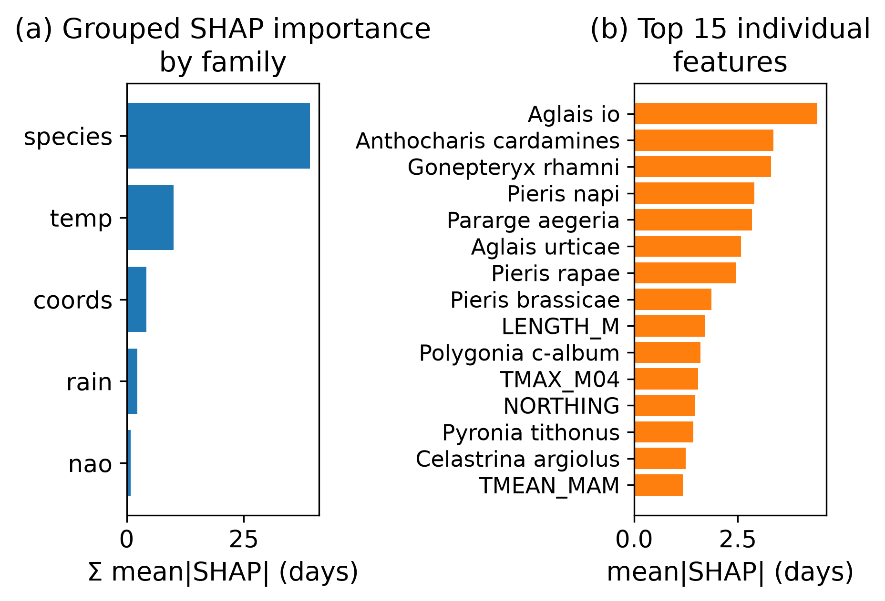
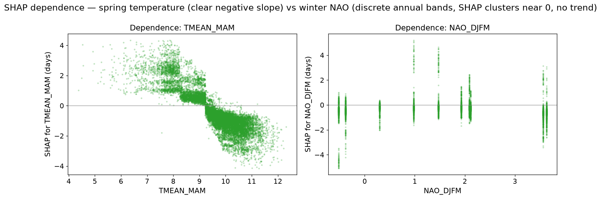

# Machine-learning report — RQ2 (predictability & distribution shift) + RQ3 (NAO beyond temperature)

_Generated 2026-09-06. Target = FIRSTDAY (days after 1 April). Code: `scripts/modelling/{ml_baseline,ml_report}.py`. Models share the harness, so their rows are in `output/model_metrics.csv` & `output/model_predictions.parquet`._

## Features & leakage discipline (Part 1)

- **38 numeric predictors + species** (one-hot), all pre-flight (Dec y−1 → 31 May y):
  - temperature (25): monthly & seasonal TMAX/TMIN/TMEAN + GDD
  - rainfall (8): monthly & seasonal totals
  - NAO block (2, toggleable for RQ3): ['NAO_DJFM', 'NAO_DJFM_LAG1']
  - coordinates (3): ['EASTING', 'NORTHING', 'LENGTH_M'] — **spatial attributes, not site dummies**, so they generalise to held-out sites in grouped-CV.
  - species identity: one-hot (every species appears in train & test).
- **Leakage guard (asserted in code):** none of FIRSTDAY, LASTDAY, PEAKDAY, PEAKCOUNT, MEAN_FLIGHT_DATE, FLIGHTPERIOD_*, SITE_INDEX (+ sentinels), TREND_*, NATIONAL_*, or **raw YEAR** may enter X. Raw YEAR is excluded because trees extrapolate flat — a YEAR feature saturates at the last training year and cannot help on 2015–2024 (a with-YEAR sensitivity is reported for grouped-CV only, below).
- Splits reused verbatim from `modelling_frame` (temporal ≤2014/>2014; grouped 5-fold by SITE_ID). Row count preserved at every join. **Target never imputed.**

## Models & configuration (Part 2)

- **`ml_hgb` — HistGradientBoostingRegressor (PRIMARY).** Handles the ~2.8% missing climate **natively (no imputation)**; species **one-hot** (not HGB's native categorical, so TreeSHAP stays additive — see SHAP note). Params: `{'max_iter': 400, 'learning_rate': 0.05, 'max_leaf_nodes': 63, 'min_samples_leaf': 100, 'l2_regularization': 1.0, 'early_stopping': True, 'validation_fraction': 0.1, 'n_iter_no_change': 20, 'random_state': 42}`.
- **`ml_rf` — RandomForestRegressor (comparator).** Needs complete X → climate **median-imputed with TRAIN-ONLY medians** (per fold / per temporal-train, never test); species one-hot. Params: `{'n_estimators': 200, 'min_samples_leaf': 25, 'max_features': 0.5, 'max_samples': 0.5, 'n_jobs': -1, 'random_state': 42}`.
- Seeds fixed (`ML_SEED = 42`). HGB early-stops on an internal validation slice of TRAIN; no test/CV-fold leakage. Deliberately light tuning — a sensible fixed config, not heavy search.

## The model ladder — one comparison table (Part 4)

| model | regime | n | MAE | RMSE | R2 | bias |
| --- | --- | --- | --- | --- | --- | --- |
| ml_rf | grouped_cv | 620,711 | 20.30 | 28.69 | 0.47 | 0.07 |
| ml_rf_nonao | grouped_cv | 620,711 | 20.34 | 28.72 | 0.47 | 0.08 |
| ml_hgb | grouped_cv | 620,711 | 20.67 | 28.88 | 0.47 | 0.41 |
| ml_hgb_nonao | grouped_cv | 620,711 | 20.73 | 28.93 | 0.46 | 0.41 |
| me_nao_temp | grouped_cv | 524,672 | 21.31 | 29.66 | 0.44 | 0.00 |
| me_nao | grouped_cv | 524,672 | 21.83 | 30.16 | 0.42 | 0.00 |
| site_species_mean | grouped_cv | 620,711 | 22.33 | 30.67 | 0.40 | 0.00 |
| species_mean | grouped_cv | 620,711 | 22.33 | 30.67 | 0.40 | 0.00 |
| gdd_process | grouped_cv | 612,192 | 22.41 | 32.36 | 0.33 | -5.12 |
| persistence | grouped_cv | 620,711 | 23.54 | 34.89 | 0.22 | -1.54 |
| ml_hgb | temporal | 325,738 | 21.22 | 29.82 | 0.40 | -1.01 |
| ml_hgb_nonao | temporal | 325,738 | 21.24 | 29.78 | 0.40 | -0.75 |
| site_species_mean | temporal | 325,738 | 21.27 | 30.46 | 0.37 | -0.26 |
| me_nao | temporal | 255,491 | 21.32 | 30.18 | 0.39 | -3.11 |
| ml_rf_nonao | temporal | 325,738 | 21.37 | 29.91 | 0.40 | -0.76 |
| ml_rf | temporal | 325,738 | 21.39 | 29.90 | 0.40 | -0.72 |
| me_nao_temp | temporal | 255,491 | 21.52 | 29.82 | 0.40 | -0.39 |
| species_mean | temporal | 325,738 | 21.97 | 30.29 | 0.38 | -0.23 |
| gdd_process | temporal | 321,773 | 23.15 | 34.42 | 0.20 | -10.48 |
| persistence | temporal | 325,738 | 23.23 | 34.42 | 0.20 | -2.05 |

**RQ2 headline.** On the temporal hold-out (2015–2024), **`ml_hgb` MAE = 21.22 days** vs site×species climatology 21.27 and GDD 23.15. ML beats both out of sample, in both regimes — but the margin over climatology is modest (~1 day): species identity + spring temperature carry most of the signal a simple species mean already half-captures.

## Distribution shift — the recent warm years (Part 4)

Per-year **mean bias (pred − obs)** on the temporal test, mirroring the GDD warming-bias table:

| YEAR | ml_hgb | ml_rf | gdd_process | species_mean |
| --- | --- | --- | --- | --- |
| 2015 | +0.11 | +0.86 | +1.83 | +0.99 |
| 2016 | +1.56 | +0.49 | -6.16 | -5.30 |
| 2017 | +1.01 | +0.48 | -11.70 | +5.81 |
| 2018 | +2.59 | +2.40 | -5.84 | +1.16 |
| 2019 | +0.33 | +0.46 | -7.77 | +2.44 |
| 2020 | -12.34 | -11.44 | -21.96 | -5.60 |
| 2021 | +1.36 | +3.31 | -0.82 | -5.49 |
| 2022 | -0.56 | +0.74 | -9.32 | +4.69 |
| 2023 | -0.64 | -0.34 | -14.49 | -0.68 |
| 2024 | -4.70 | -5.54 | -26.32 | -2.05 |

**ML does NOT inherit the GDD warming bias.** GDD drifts strongly negative in warm years (2024 bias -26.3 d — far too early); `ml_hgb` stays near zero (2024 -4.7 d). The booster tracks recent warm springs far better than the single-S* model, though a mild late-period bias remains (it cannot extrapolate beyond the training climate envelope).

### Error by voltinism class (echoing the GDD single- vs multi-brood split)

| voltinism | ml_hgb_MAE | gdd_process_MAE | species_mean_MAE |
| --- | --- | --- | --- |
| univoltine | 11.41 | 13.33 | 12.00 |
| multivoltine | 30.24 | 32.54 | 31.50 |
| variable | 16.96 | 19.79 | 17.19 |

Unlike GDD (which broke down for multivoltine / complex-phenology species), the ML model is comparably accurate across voltinism classes — it does not rely on a single-generation thermal threshold.

## RQ3 — does the NAO add signal beyond local temperature? (Part 3)

| model | regime | MAE_with_nao | MAE_no_nao | dMAE_from_nao | dR2_from_nao |
| --- | --- | --- | --- | --- | --- |
| ml_hgb | temporal | +21.215 | +21.241 | -0.026 | -0.002 |
| ml_hgb | grouped_cv | +20.674 | +20.731 | -0.057 | +0.002 |
| ml_rf | temporal | +21.387 | +21.374 | +0.013 | +0.000 |
| ml_rf | grouped_cv | +20.299 | +20.339 | -0.039 | +0.001 |

**Answer: essentially no.** Removing the NAO block changes test MAE/RMSE by hundredths of a day in both regimes and both model families — matching the mixed-effects result (NAO moved R² by ~0.001) and the EDA collinearity (NAO–DJF-temp r ≈ 0.68): **winter NAO carries no predictive information about flight timing beyond local temperature.**

### Sensitivity — adding raw YEAR (grouped-CV only)

Adding a raw YEAR feature to `ml_hgb` changes grouped-CV MAE by **-0.037 days** (20.674 → 20.637). Negligible, and it is **excluded from the temporal model** on principle (a tree cannot extrapolate a YEAR split to unseen future years). The climate features carry the warming signal instead.

## Interpretation — SHAP (Part 5)

TreeSHAP (TreeExplainer (one-hot species)) on **15,000 temporal-test rows** (exact additivity, max reconstruction error 4.2e-08 days). **Encoding note:** the primary HGB uses one-hot species here (not native categorical) because TreeExplainer mis-attributes native-categorical splits (additivity error ~95 days, species credit ~0); one-hot restores exact additivity at negligible cost (temporal MAE 21.22 vs 21.10). Because the temperature features are highly collinear (TMEAN_MAM–GDD r ≈ 0.965), SHAP credit **splits across them** — so we read **grouped importance** (summed within family, and over species' one-hot columns).

**Grouped importance (Σ mean|SHAP|, days):**

| family | sum_mean_abs_shap | pct |
| --- | --- | --- |
| species | 39.09 | 69.23 |
| temp | 9.97 | 17.66 |
| coords | 4.21 | 7.46 |
| rain | 2.33 | 4.12 |
| nao | 0.87 | 1.54 |

- **Species identity dominates** (~69% of total attribution) — it sets the baseline emergence date, as the EDA and mixed-effects rungs showed.
- **Temperature is the leading climate driver** (~18%); the dependence plot shows the expected negative slope (warmer springs → earlier).
- **NAO contributes ~2%**; its SHAP clusters near zero with no consistent trend (the discrete vertical bands are the one NAO value per year) — confirming RQ3 from the model's own attributions.

## Assumptions & judgement calls

- Frame + splits reused verbatim from `modelling_frame` (no recomputation); all 620,711 rows kept (target complete), so ML is directly comparable to naive/GDD.
- HGB uses native NaN handling; RF imputes climate with TRAIN-ONLY medians. Neither imputes the target.
- Species one-hot for BOTH models (not HGB's native categorical) so TreeSHAP stays exactly additive; climate NaN is still handled natively by HGB.
- Raw YEAR excluded from predictors (trees extrapolate flat); with-YEAR reported for grouped-CV only as a sensitivity.
- Light fixed hyperparameters in CONFIG with a seed; HGB early-stops on an internal TRAIN validation slice — no test/fold leakage.
- SHAP computed on a 15k test sample; grouped importance is the headline because collinear temperature features split individual SHAP credit.
- RF is a modest comparator (200 trees, 50% row/feature subsampling) — not tuned to win, just to give a different inductive bias.

## Artefacts

- `output/ml_report.md` — this report
- `output/model_metrics.csv` — shared metrics incl. ml_hgb / ml_rf (+ no-NAO variants)
- `output/model_predictions.parquet` — shared long predictions incl. ML models
- `output/models/ml_shap_importance.png` — grouped + top-feature SHAP importance
- `output/models/ml_shap_dependence.png` — SHAP dependence: spring temp vs NAO
